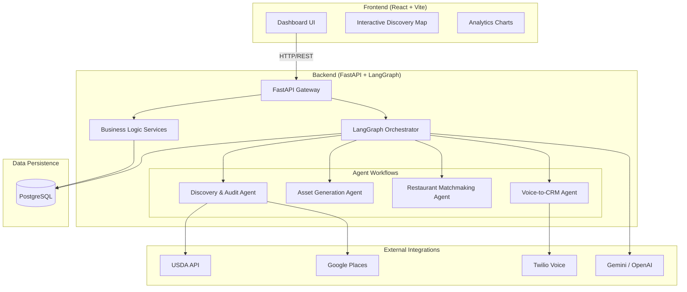
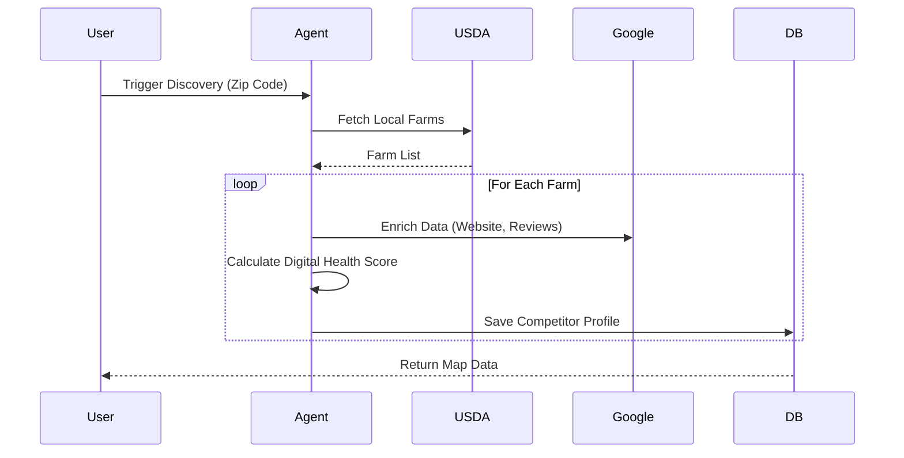
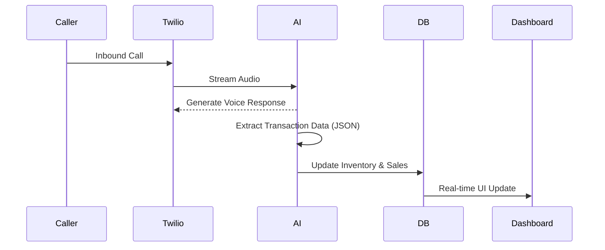

# Sprout 🌿

**Sprout** is an autonomous AI platform designed to help small farms modernize their business. It serves as an all-in-one digital workforce, handling marketing, competitive analysis, B2B sales outreach, and inventory management through voice interactions.

Sprout empowers farmers to compete with industrial agriculture by providing them with enterprise-grade digital tools: instant website generation, predictive market analytics, and an AI field agent that handles customer calls while they work.

---

## 🏗️ Architecture Overview

The platform is built as a modern monorepo featuring a high-performance asynchronous Python backend and a reactive TypeScript frontend, orchestrated by Docker.



---

## ⚡ Tech Stack

### **Backend**
*   **Framework**: FastAPI (Python 3.12+)
*   **Orchestration**: LangGraph (Multi-agent workflows)
*   **Database**: PostgreSQL with `psycopg3` (Async) & `SQLModel`
*   **Migrations**: Alembic
*   **Analysis**: `scipy.stats` for predictive modeling

### **Frontend**
*   **Framework**: React (TypeScript) + Vite
*   **Styling**: Tailwind CSS
*   **State/Data**: React Hooks & Context

### **Infrastructure**
*   **Containerization**: Docker & Docker Compose
*   **Package Management**: `uv` (Python), `pnpm` (Node)

---

## 🚀 Core Features

### 1. Discovery & Audit Pipeline 🔍
Automatically maps the local competitive landscape.
*   **Data Sources**: Ingests data from USDA Local Food Directories and Google Places.
*   **Scoring**: assigns a "Digital Health Score" (0-100) to competitor farms based on SEO, mobile responsiveness, and social presence.
*   **Visualization**: Interactive map clustering farms by health score.

### 2. Autonomous Asset Generation 🎨
Eliminates the need for marketing agencies.
*   **Persona Builder**: AI analyzes inventory to craft a unique brand voice, tagline, and story.
*   **Website Generator**: Builds and deploys complete, mobile-responsive Tailwind CSS websites.
*   **Iteration**: Farmers can preview and select from multiple generated designs.

### 3. Restaurant Matchmaking (SDR) 🤝
An autonomous B2B sales agent.
*   **Prospecting**: Identifies local farm-to-table restaurants within a 30-mile radius.
*   **Menu Analysis**: Scrapes menus for keywords matching the farm's specific inventory (e.g., "heirloom", "pasture-raised").
*   **Outreach**: Drafts hyper-personalized introduction emails for human review and sending.

### 4. Predictive Market Analytics 📈
Data-driven pricing strategies.
*   **Regression Analysis**: Uses historical pricing data to model local market trends.
*   **Forecasting**: Provides confidence intervals on future crop prices (e.g., "95% probability of zucchini prices rising").

### 5. Voice-to-CRM Field Agent 🎙️
A virtual receptionist for the field.
*   **Inbound Handling**: Answers calls via Twilio, using generative AI to converse with customers.
*   **Transaction Logging**: Extracts structured order data (Crop, Quantity, Buyer) from natural conversation.
*   **Real-time Sync**: Updates inventory and sales records in the dashboard instantly.

---

## 📂 Project Structure

```bash
Sprout/
├── backend/                # Python FastAPI Application
│   ├── src/
│   │   ├── agents/         # LangGraph workflows (Discovery, SDR, etc.)
│   │   ├── api/            # REST endpoints
│   │   ├── core/           # Config & Settings
│   │   ├── db/             # Database session management
│   │   ├── models/         # SQLModel database tables
│   │   └── tools/          # Agent capabilities (Scrapers, API wrappers)
│   └── alembic/            # Database migrations
├── frontend/               # React Application
│   ├── src/
│   │   ├── components/     # Reusable UI elements
│   │   ├── pages/          # Application views
│   │   └── lib/            # Utilities
└── docker-compose.yml      # Orchestration config
```

---

## 🛠️ Setup & Installation

### Prerequisites
*   Docker & Docker Compose
*   Python 3.12+ (optional, for local tool access)
*   Node.js & pnpm (optional, for local frontend dev)

### Running the Application

1.  **Clone the repository:**
    ```bash
    git clone https://github.com/your-org/sprout.git
    cd sprout
    ```

2.  **Environment Setup:**
    Copy the example environment files and fill in your API keys (OpenAI, Google Places, Twilio, etc.).
    ```bash
    cp .env.example .env
    cp backend/.env.example backend/.env
    cp frontend/.env.example frontend/.env
    ```

3.  **Start with Docker Compose:**
    ```bash
    docker compose -f docker-compose.dev.yml up --build
    ```
    *   **Backend API**: http://localhost:8000
    *   **Frontend Dashboard**: http://localhost:5173
    *   **API Docs**: http://localhost:8000/docs

---

## 🧠 Agent Workflows

### Discovery Pipeline


### Voice-to-CRM Flow


---

## 🤝 Contributing

1.  Create a feature branch from `main`.
2.  Ensure all backend changes include Alembic migrations.
3.  Add tests for new agents or API endpoints.
4.  Submit a Pull Request with a detailed description of changes.

---

**Sprout** — *Growing the future of local agriculture.*
