# Sprout 🌿

**Sprout** is an autonomous AI platform designed to help small farms modernize their business. It serves as an all-in-one digital workforce, handling marketing, competitive analysis, B2B sales outreach, and inventory management through voice interactions.

Sprout empowers farmers to compete with industrial agriculture by providing them with enterprise-grade digital tools: instant website generation, predictive market analytics, and an AI field agent that handles customer calls while they work.

---

## 🏗️ Architecture Overview

The platform is built as a modern monorepo featuring a high-performance asynchronous Python backend and a reactive TypeScript frontend, orchestrated by Docker.

```mermaid
graph TB
    subgraph CLIENT["Frontend — React 19 / Vite / TypeScript"]
        direction TB
        LP["LandingPage<br/><i>GSAP scroll animations</i>"]
        OP["OnboardingPage<br/><i>3-step farmer/shopper flow</i>"]
        DP["DiscoveryPage<br/><i>Interactive competitor map</i>"]

        subgraph DASH["DashboardPage — 5 Tabs"]
            direction LR
            TAB_AUDIT["Audit<br/>Digital Health Score"]
            TAB_WEB["Website<br/>Generated Layouts"]
            TAB_MARKET["Market Intel<br/>Pricing & Inventory"]
            TAB_REST["Restaurant Match<br/>Outreach Pipeline"]
            TAB_VOICE["Voice Agent<br/>Call Logs & CRM"]
        end
    end

    subgraph API_LAYER["FastAPI Backend — API Layer"]
        direction TB
        R_FARMS["/api/v1/farms<br/>POST /discover · CRUD"]
        R_INV["/api/v1/inventory<br/>CRUD + farm_id filter"]
        R_ANALYTICS["/api/v1/analytics<br/>GET /predictive-pricing<br/>POST /run"]
        R_OUTREACH["/api/v1/outreach<br/>search-restaurants · drafts<br/>send-direct · approve & send"]
        R_PRICING["/api/v1/pricing<br/>Commodity pricing CRUD"]
        R_BUILDER["/api/v1/builder<br/>POST /build/{farm_id}"]
        R_TX["/api/v1/transactions<br/>Voice-to-CRM logging"]
    end

    subgraph AGENTS["LangGraph Multi-Agent Orchestration"]
        direction TB

        subgraph AG_DISC["Discovery Agent"]
            D1["Search USDA<br/>Local Food API"] --> D2["Enrich via<br/>Google Places"]
            D2 --> D3["Scrape & Analyze<br/>Competitor Websites"]
            D3 --> D4["Calculate Digital<br/>Health Scores"]
        end

        subgraph AG_BUILD["Builder Agent"]
            B1["Generate Brand<br/>Persona via LLM"] --> B2["Suggest<br/>Domain Names"]
            B2 --> B3["Generate Tailwind<br/>Website Layouts"]
        end

        subgraph AG_INGEST["Data Ingestion Agent"]
            I1["Fetch USDA<br/>Market News"] --> I2["Persist to<br/>CommodityPricing"]
            I2 --> I3["Trigger Analytics<br/>Agent"]
        end

        subgraph AG_ANALYTICS["Analytics Agent"]
            A1["Regression Modeling<br/><i>scipy.stats</i>"] --> A2["Fetch Weather &<br/>Market Context"]
            A2 --> A3["LLM Generates<br/>Plain-Language Insights"]
        end

        subgraph AG_SDR["SDR Agent"]
            S1["Search Farm-to-Table<br/>Restaurants"] --> S2["Scrape Menus &<br/>Match Keywords"]
            S2 --> S3["Draft Personalized<br/>Outreach Emails"]
            S3 --> S4["Human-in-the-Loop<br/>Approve & Send"]
        end
    end

    subgraph SERVICES["Services"]
        SVC_PRICING["PricingAnalyticsService<br/><i>Linear regression + prediction intervals</i>"]
        SVC_OUTREACH["OutreachService<br/><i>AI email drafting + approval workflow</i>"]
    end

    subgraph TOOLS["LangChain Tools — External Integrations"]
        direction TB
        T_USDA["USDA APIs<br/><i>Local Food · Market News</i>"]
        T_GOOGLE["Google Places API<br/><i>Search · Geocoding · Details</i>"]
        T_WEATHER["OpenWeather API<br/><i>Agricultural forecasts</i>"]
        T_GMAIL["Gmail API<br/><i>OAuth 2.0 email send</i>"]
        T_HUNTER["Hunter.io<br/><i>Email finder</i>"]
        T_SERP["SerpAPI<br/><i>LinkedIn · Events search</i>"]
        T_SCRAPE["Web Scraper<br/><i>BeautifulSoup + Playwright</i>"]
        T_LLM["OpenRouter LLM<br/><i>Gemini 2.5 Flash</i>"]
    end

    subgraph DB["PostgreSQL 15"]
        direction LR
        TBL_FARM[("farm<br/><i>profiles & health scores</i>")]
        TBL_INV[("farminventory<br/><i>crop stock per farm</i>")]
        TBL_PRICE[("commoditypricing<br/><i>county-level history</i>")]
        TBL_TX[("transaction<br/><i>voice-logged sales</i>")]
        TBL_EMAIL[("outreachemail<br/><i>draft → sent → replied</i>")]

        TBL_FARM -->|1 : N| TBL_INV
        TBL_FARM -->|1 : N| TBL_TX
        TBL_FARM -->|1 : N| TBL_EMAIL
    end

    subgraph INFRA["Infrastructure — Docker Compose"]
        direction LR
        DC_FE["frontend<br/><i>Vite dev :5173<br/>nginx prod :80</i>"]
        DC_BE["backend<br/><i>Uvicorn :8000</i>"]
        DC_DB["db<br/><i>postgres:15-alpine :5432</i>"]
    end

    %% ── Client → API ──
    DASH -->|"fetch / REST"| API_LAYER
    DP -->|"POST /farms/discover"| R_FARMS
    TAB_MARKET -->|"GET predictive-pricing<br/>GET inventory"| R_ANALYTICS
    TAB_MARKET -->|"GET inventory"| R_INV
    TAB_REST -->|"search-restaurants<br/>drafts · send"| R_OUTREACH
    TAB_WEB -->|"POST /build/{farm_id}"| R_BUILDER
    TAB_VOICE -->|"POST/GET transactions"| R_TX

    %% ── API → Agents ──
    R_FARMS -->|"invoke"| AG_DISC
    R_ANALYTICS -->|"invoke"| AG_INGEST
    R_BUILDER -->|"invoke"| AG_BUILD
    R_OUTREACH -->|"invoke"| AG_SDR
    AG_INGEST -->|"invoke"| AG_ANALYTICS

    %% ── API → Services ──
    R_ANALYTICS -->|"analyze"| SVC_PRICING
    R_OUTREACH -->|"draft"| SVC_OUTREACH

    %% ── Agents / Services → Tools ──
    AG_DISC --> T_USDA
    AG_DISC --> T_GOOGLE
    AG_DISC --> T_SCRAPE
    AG_INGEST --> T_USDA
    AG_ANALYTICS --> T_WEATHER
    AG_ANALYTICS --> T_LLM
    AG_BUILD --> T_LLM
    AG_SDR --> T_GOOGLE
    AG_SDR --> T_SCRAPE
    AG_SDR --> T_HUNTER
    AG_SDR --> T_GMAIL
    SVC_OUTREACH --> T_LLM
    SVC_OUTREACH --> T_GMAIL

    %% ── Data Layer ──
    API_LAYER -->|"SQLModel async"| DB
    AGENTS -->|"CRUD persist"| DB
    SVC_PRICING -->|"query pricing history"| TBL_PRICE

    %% ── Infrastructure wiring ──
    DC_FE -.->|"HTTP :5173/:80"| CLIENT
    DC_BE -.->|"HTTP :8000"| API_LAYER
    DC_DB -.->|"TCP :5432"| DB

    %% ── Styling ──
    classDef frontend fill:#e0f2fe,stroke:#0284c7,color:#0c4a6e
    classDef api fill:#fef3c7,stroke:#d97706,color:#78350f
    classDef agent fill:#ede9fe,stroke:#7c3aed,color:#3b0764
    classDef service fill:#fce7f3,stroke:#db2777,color:#831843
    classDef tool fill:#d1fae5,stroke:#059669,color:#064e3b
    classDef database fill:#fee2e2,stroke:#dc2626,color:#7f1d1d
    classDef infra fill:#f3f4f6,stroke:#6b7280,color:#1f2937

    class LP,OP,DP,DASH,TAB_AUDIT,TAB_WEB,TAB_MARKET,TAB_REST,TAB_VOICE frontend
    class R_FARMS,R_INV,R_ANALYTICS,R_OUTREACH,R_PRICING,R_BUILDER,R_TX api
    class AG_DISC,AG_BUILD,AG_INGEST,AG_ANALYTICS,AG_SDR,D1,D2,D3,D4,B1,B2,B3,I1,I2,I3,A1,A2,A3,S1,S2,S3,S4 agent
    class SVC_PRICING,SVC_OUTREACH service
    class T_USDA,T_GOOGLE,T_WEATHER,T_GMAIL,T_HUNTER,T_SERP,T_SCRAPE,T_LLM tool
    class TBL_FARM,TBL_INV,TBL_PRICE,TBL_TX,TBL_EMAIL database
    class DC_FE,DC_BE,DC_DB infra
```



---

## ⚡ Tech Stack

### **Backend**
*   **Framework**: FastAPI (Python 3.12+)
*   **Orchestration**: LangGraph (Multi-agent workflows)
*   **Database**: PostgreSQL with `psycopg3` (Async) & `SQLModel`
*   **Migrations**: Alembic
*   **Analysis**: `scipy.stats` for predictive modeling

### **Frontend**
*   **Framework**: React (TypeScript) + Vite
*   **Styling**: Tailwind CSS
*   **State/Data**: React Hooks & Context

### **Infrastructure**
*   **Containerization**: Docker & Docker Compose
*   **Package Management**: `uv` (Python), `pnpm` (Node)

---

## 🚀 Core Features

### 1. Discovery & Audit Pipeline 🔍
Automatically maps the local competitive landscape.
*   **Data Sources**: Ingests data from USDA Local Food Directories and Google Places.
*   **Scoring**: assigns a "Digital Health Score" (0-100) to competitor farms based on SEO, mobile responsiveness, and social presence.
*   **Visualization**: Interactive map clustering farms by health score.

### 2. Autonomous Asset Generation 🎨
Eliminates the need for marketing agencies.
*   **Persona Builder**: AI analyzes inventory to craft a unique brand voice, tagline, and story.
*   **Website Generator**: Builds and deploys complete, mobile-responsive Tailwind CSS websites.
*   **Iteration**: Farmers can preview and select from multiple generated designs.

### 3. Restaurant Matchmaking (SDR) 🤝
An autonomous B2B sales agent.
*   **Prospecting**: Identifies local farm-to-table restaurants within a 30-mile radius.
*   **Menu Analysis**: Scrapes menus for keywords matching the farm's specific inventory (e.g., "heirloom", "pasture-raised").
*   **Outreach**: Drafts hyper-personalized introduction emails for human review and sending.

### 4. Predictive Market Analytics 📈
Data-driven pricing strategies.
*   **Regression Analysis**: Uses historical pricing data to model local market trends.
*   **Forecasting**: Provides confidence intervals on future crop prices (e.g., "95% probability of zucchini prices rising").

### 5. Voice-to-CRM Field Agent 🎙️
A virtual receptionist for the field.
*   **Inbound Handling**: Answers calls via Twilio, using generative AI to converse with customers.
*   **Transaction Logging**: Extracts structured order data (Crop, Quantity, Buyer) from natural conversation.
*   **Real-time Sync**: Updates inventory and sales records in the dashboard instantly.

---

## 📂 Project Structure

```bash
Sprout/
├── backend/                # Python FastAPI Application
│   ├── src/
│   │   ├── agents/         # LangGraph workflows (Discovery, SDR, etc.)
│   │   ├── api/            # REST endpoints
│   │   ├── core/           # Config & Settings
│   │   ├── db/             # Database session management
│   │   ├── models/         # SQLModel database tables
│   │   └── tools/          # Agent capabilities (Scrapers, API wrappers)
│   └── alembic/            # Database migrations
├── frontend/               # React Application
│   ├── src/
│   │   ├── components/     # Reusable UI elements
│   │   ├── pages/          # Application views
│   │   └── lib/            # Utilities
└── docker-compose.yml      # Orchestration config
```

---

## 🛠️ Setup & Installation

### Prerequisites
*   Docker & Docker Compose
*   Python 3.12+ (optional, for local tool access)
*   Node.js & pnpm (optional, for local frontend dev)

### Running the Application

1.  **Clone the repository:**
    ```bash
    git clone https://github.com/your-org/sprout.git
    cd sprout
    ```

2.  **Environment Setup:**
    Copy the example environment files and fill in your API keys (OpenAI, Google Places, Twilio, etc.).
    ```bash
    cp .env.example .env
    cp backend/.env.example backend/.env
    cp frontend/.env.example frontend/.env
    ```

3.  **Start with Docker Compose:**
    ```bash
    docker compose -f docker-compose.dev.yml up --build
    ```
    *   **Backend API**: http://localhost:8000
    *   **Frontend Dashboard**: http://localhost:5173
    *   **API Docs**: http://localhost:8000/docs

---

## 🧠 Agent Workflows

### Discovery Pipeline


### Voice-to-CRM Flow


---

## 🤝 Contributing

1.  Create a feature branch from `main`.
2.  Ensure all backend changes include Alembic migrations.
3.  Add tests for new agents or API endpoints.
4.  Submit a Pull Request with a detailed description of changes.

---

**Sprout** — *Growing the future of local agriculture.*
